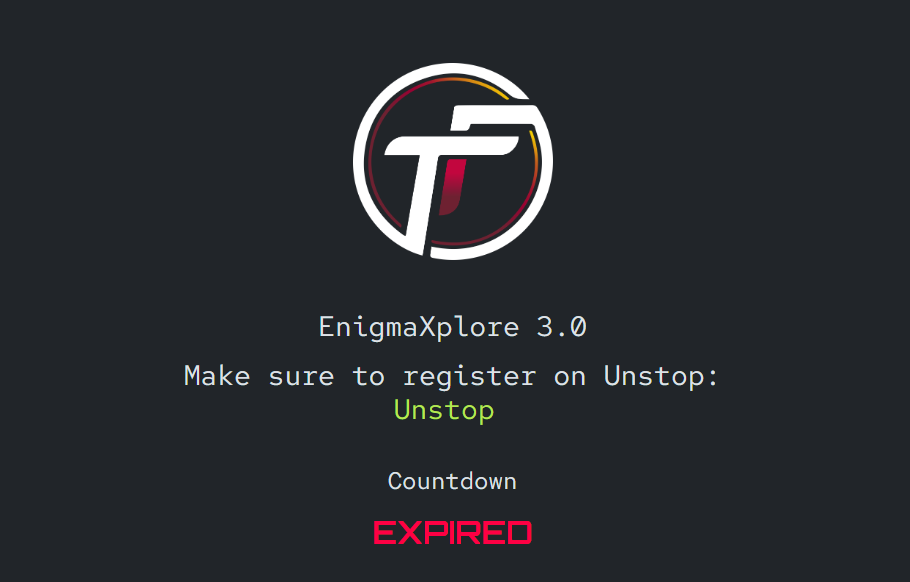
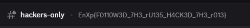
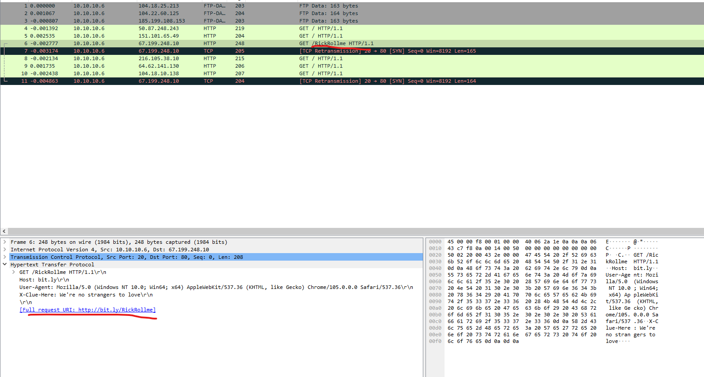
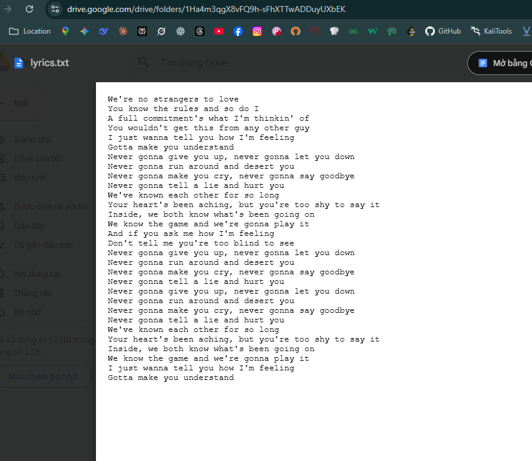
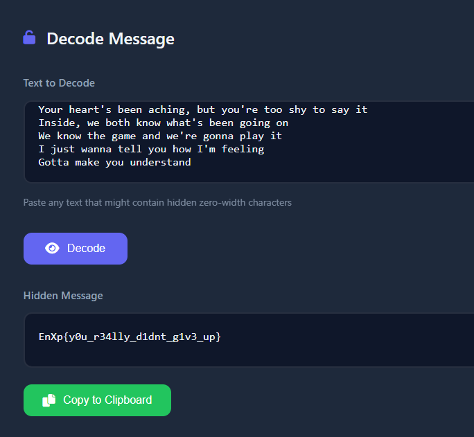
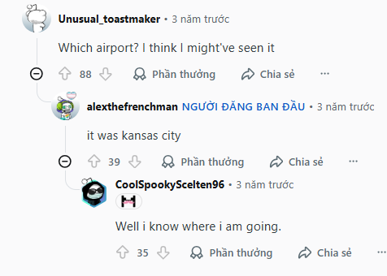
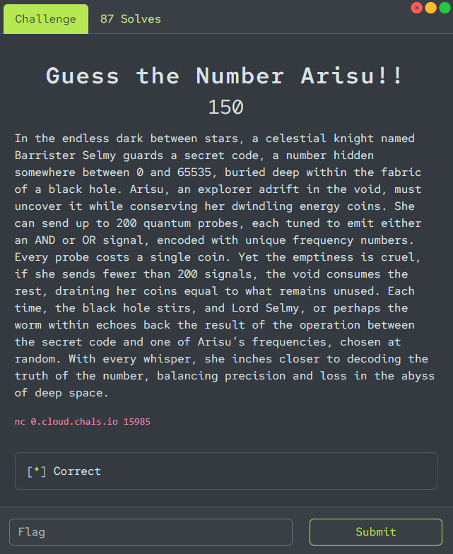

# EnigmaXplore 3.0 Writeup 



Đây là Writeup giải EnigmaXplore3.0 của tôi khi đấm cho đội M3RC3NARY & s1lv3r_Bull3t

List các bài tôi đã giải được : 
- Misc
  - Sanity Check
  - Never Gonna Solve You
- OSINT
  - Bored Waiting
  - Lights out and here we go!
- Programming	
  - Guess the Number Arisu!!
  - Hidden Chamber of Arrays
  - Yet Another Guessing Arcade


# Misc
## Sanity check

Bài này thì khá easy, ban đầu vào discord của giải thì tìm sẽ không thấy gì, nhưng cứ follow theo rule như đề bài hint , lấy role là được vào kênh `hackers-only`



Flag : `EnXp{F0110W3D_7H3_rU135_H4CK3D_7H3_r013}`


## Never Gonna Solve You

Bài cho ta 1 ảnh RickRoll. Cứ làm các bước cơ bản khi phân tích 1 file ảnh thì đến khi `binwalk` thì thấy có nhúng 1 file `zip`

Extract file thì nó yêu cầu mật khẩu, thì lúc này tôi sử dụng luôn đoạn `weknowthegameandweregonnaplayit `, vì lúc đọc đề bài tôi đã khá ấn tượng và để ý tới dòng chữ này :))) . Bingo, nó chính xác là mật khẩu, giúp tôi tiết kiệm kha khá time nếu tôi đi theo hướng tìm mật khẩu giấu trong ảnh hoặc crack.


Như trên ảnh thì ban đầu chỉ có file `flag.mp4`, chúng ta vẫn cứ phân tích nó bằng các công cụ cơ bản và binwalk ra được 1 vài file gồm `.rar, .yaffs, .pcapng`

Tôi xem qua file `.yaffs` thì thấy không có gì lắm và quyết định xem file `.pcapng` kia. (nếu mà file .pcapng không có gì thật thì tôi sẽ quay lại với file .yaffs để kiểm tra kĩ hơn)



Các gói tin HTTP này đều dẫn đến các url mang tính chất troll là chính. Nhưng mà ngoại từ trang `http://bit.ly/RickRollme` ở trên ảnh thì rất là sus :v




Nó redirect đến 1 trang gg drive có file lyrics.txt toàn lời bài hát. Tôi tải về và well, i got stuck here.

Tôi dành khá lâu để hiểu nó là gì, xong rồi lại phân tích lại các file cũ,... nhưng không có thêm manh mối gì.

Và thế nào người anh `F@mfam` của tôi lại mạnh, đã tìm ra quả web `https://stegzero.com/` .





Nói chung là chall này cái chỗ khoai nhất thì tôi húp được từ anh `F@mfam` hehe :)))

Flag : `EnXp{y0u_r34lly_d1dnt_g1v3_up}`


# OSINT

## Bored Waiting


Bài này yêu cầu time và location. 

Time thì ngay kia rồi : 6:22AM

Vứt ảnh lên gg image tìm thì thế nào lại may mắn ra luôn bài đăng trên `reddit` có chứa video gốc của ảnh này. 
`https://www.reddit.com/r/Markiplier/comments/12w5fwk/mark_on_an_airport_tv/`

Lướt xuống đọc cmt thì khá chắc chắn nó ở `kansas city`




Lên gg search và dùng luôn con Gemini Pro đang được free, tìm các từ khoá liên quan đến `kansas airport`
Và biết đây chính xác là Sân bay quốc tế Kansas CIty `MCI`.

Flag : `EnXp{6:22AM_MCI}`


## Lights out and here we go!


Bài này yêu cầu tìm tên chính xác của Hotel mà tác giả cần. Hướng đi sẽ là xác định xem đó là trường đua nào, sau đó dựa vào việc đề bài cho là Hotel trông như 1 cái Mansion từ phía trước, và từ Hotel đó đến trường đua thì khoảng 15 phút để thu hẹp phạm vi cần tìm

Đầu tiên cứ đưa nó lên gg image thì tôi thấy khá nhiều kết quả trùng với chiếc xe này, tôi dò tìm trong các video youtube về tên của trường đua, xem quang cảnh xung quanh rồi đối chiếu với gg map, Và kết hợp hint về 1 record 1:15.48 của 1 tay đua thì tôi có thể chắc chắn đây là trường đua `imola`  ở Ý.


Ban đầu việc tác giả viết là cách 15 phút thì tôi không rõ là đi bộ hay đi xe. Sau khi tác giả đã confirm thì tôi tiến hành tìm tất cả các HOTEL nào trong bán kính 15 phút driving và có vẻ ngoài trông như 1 Mansion. 

Tôi đã phải thử rất nhiều và lâu, kết hợp cả Gemini và Google Map thì biết đó là `Grand Hotel Terme Riolo` . Nếu bạn có cách nào hay ho hơn hãy cho tôi biết !!!

Flag : `EnXp{GRAND_HOTEL_TERME_RIOLO}`


# Programming

## Guess the Number Arisu!!


```
Welcome to the Arcade of Number Guessing!

Rules:
1. You can perform two types of operations: AND or OR.
2. For each operation, you provide up to 200 unique numbers.
3. Each query costs 1 coin.
4. If you use fewer than 200 numbers in a query,
   you must also pay (200 - number_of_numbers_used) extra coins.
   For example:
      - Using 200 numbers : costs 1 coin.
      - Using 150 numbers : costs 51 coins.
      - Using 1 number    : costs 200 coins.
5. For each query, Barrister Selmy will randomly select ONE of the numbers you provided
   and return the result of (X <operation> that number),
   where X is the hidden secret number you are trying to guess.
6. Your goal is to find X using the fewest coins possible!

Example:
   Operation: AND
   Numbers provided: 10, 15, 200
   Lord Selmy might randomly pick 15 and return (X AND 15).
   Total coins used = 1 (base cost) + (200 - 3) = 198 coins.


====================== MENU ======================
1. Make a Query (use AND/OR operation)
2. Guess the Number
3. Show Coins
4. Exit
==================================================
Enter your choice:
```
Giải thích đơn giản cách hoạt động của Chall này như sau :
- đầu tiên ta cần tìm 1 số gọi là `X`, số này như hint đề bài cho thì sẽ chạy trong đoạn [0,65535] tức là 1 số `16 bit`
- Đề bài cho chúng ta tạo các `Query` , sử dụng phép AND hoặc OR tuỳ chọn. Cụ thể hơn, mỗi khi tạo 1 Query thì ta sẽ nhập các số bắt buộc phải **khác nhau** , tối đa 200 số . Sau đó hệ thống sẽ nhót bừa 1 số trong những số ta vừa nhập để AND/OR với `X` rồi trả về màn hình (AND/OR phụ thuộc vào lựa chọn ban đầu)
- Và khi sử dụng Query sẽ tốn `Coin`. Cách tính coin bị tốn này khá đặc biệt khi mà số lượng phần tử trong Query càng nhiều thì lượng coin tiêu tốn càng ít. Ví dụ khi ta gửi Query có `k` phần tử thì lượng Coin tiêu tốn sẽ là `1 + (200 - k)` . 

### Hướng làm :


Hiểu được cách mà Chall này hoạt động thì ta bắt đầu làm. 

Nhiệm vụ đó là tìm 1 số `X` 16 bit. Đề bài cho ta 2 toán tử đó là AND và OR, ngay lập tức tôi nghĩ đến `bitmask`. 

Logic :
- Với `AND`, chúng ta có thể lấy được các bit của 1 số bằng cách & nó với các bit 1
- Với `OR`, chúng ta có thể lấy được các bit của 1 số bằng cách | nó với các bit 0

Cách làm là chúng ta sẽ send dãy Query của chúng ta bằng các số có các bitmask là 1 (nếu dùng AND) hoặc các số có bitmask là 0 ( nếu dùng OR) . Có thể tách số X đó làm 2 phần bit cao và bit thấp, sau đó query 2 lần. Nhưng tôi sẽ send các số 32 bit luôn cho nhanh vì chỉ cần 1 lần Query

```python
from pwn import *

host = "0.cloud.chals.io"
port = 15985

ok = remote(host, port)
ok.recvuntil(b'Which portal would you like to enter?')
ok.sendline(b'0')

ok.recvuntil(b'Enter your choice:')
ok.sendline(b'1')  
ok.recvuntil(b'Enter operation type (1 for AND, 2 for OR):')
ok.sendline(b'1')  
ok.recvuntil(b'Enter up to 200 unique numbers (end with -1):')

for i in range(200):
    num = (i << 16) | 0xFFFF
    ok.sendline(str(num).encode())
ok.sendline(b'-1')

ok.recvuntil(b'Result: ')
x = int(ok.recvline().strip())
print("X =", x)

ok.recvuntil(b'Enter your choice:')
ok.sendline(b'2')
ok.recvuntil(b'Enter your guess:')
ok.sendline(str(x).encode())
print(ok.recvuntil(b'Which portal would you like to enter?').decode())

ok.close()
```

```python
└─$ python3 solve.py
[+] Opening connection to 0.cloud.chals.io on port 15985: Done
X = 19085
 EnXp{L0RD_TT_TH4_G04T}
Which portal would you like to enter?
[*] Closed connection to 0.cloud.chals.io port 15985
```
Flag : ` EnXp{L0RD_TT_TH4_G04T}`

## Hidden Chamber of Arrays

```
Hidden Chamber of Arrays 200 Long ago, in the vaults of Gringotts Wizarding Bank, Headmaster Dumbledore hid a powerful secret , an enchanted array of numbers known only to him and the Goblin Guardians. You, a young wizard or witch from an ancient family of magicians, have been chosen to retrieve it. The goblins will not give up the array easily , they will only answer your questions in riddles of remainders. To uncover the array, you must interact with them wisely and prove your worth.
```
```
========================================
   Welcome to GRINGOTTS WIZARDING BANK
   Dumbledore's Hidden Array
========================================

Greetings, young witch or wizard!
You have been chosen to retrieve Dumbledore's enchanted array.

The Goblin Guardians whisper: The array contains 112 magical elements.
Each element is a positive integer between 10,000 and 1,000,000.

========================================
        THE RULES OF MAGIC
========================================

SPELL 1 - The Remainder Charm
  Format: ? i j
  Effect: The goblins whisper back A[i] % A[j]
  Note: Indices are 1-based (1 to 112)
  Warning: Each question drains your magical energy!

SPELL 2 - The Revelation Incantation
  Format: ! A1 A2 A3 ... An
  Effect: Submit your complete array reconstruction
  Success: Vault opens, FLAG revealed!
  Failure: Banished from Gringotts forever!
  Warning: You get only ONE attempt!

Magical Energy Limit: 334 queries

"Magic is the art of asking the right questions."
                               - Albus Dumbledore
========================================
```

Tiếp tục với 1 chall programming nữa. Bắt đầu với việc đọc hiểu đề và phân tích chương trình khi nc vào thì tôi sẽ nói lại cách hoạt động của nó 1 cách dễ hiểu như sau :
- Mục tiêu của Chall đó là tìm đúng cái `array` mà đề bài yêu cầu. `array` này gồm chính xác 141 phần tử, index đánh số từ 1->141 và giá trị của từng phần từ là [1e4, 1e6]. Ta phải đi tìm value của từng phần tử đó
- Chall sẽ cho ta 2 lựa chọn để Query
  - `? i j` : lệnh này sẽ trả về kết quả của **A[i] % A[j]**
  - `! A1 A2 A3 ... An` : lệnh này sẽ sử dụng để submit array mà ta tìm được, đúng sẽ print ra flag. 
- Và Chall giới hạn số lần Query, số này thì tôi nhận thấy nó random trong khoảng 300-400, có thể khác.

### Hướng làm :
Ta sẽ tập trung khai thác query `? i j` vì nó trả về **A[i] % A[j]** , có 3 trường hợp :
- A[i] > A[j] : Trả về 1 số nhỏ hơn A[j]
- A[i] < A[j] : Trả về chính A[i]
- A[i] = A[j] : ret 0 

Ta gọi `x = ? i j` và `y = ? j i`. 

Nếu x > y: Giả sử A[i] > A[j] thì `x` sẽ phải nhỏ hơn A[j] và `y` sẽ chính là A[j]. Như vậy thì x > y sẽ vô lý.  Đổi lại nếu giả sử A[i] < A[j] thì lúc này `x` chính là A[j] và y sẽ phải nhỏ hơn A[j] , hoàn toàn hợp lý

Từ đó ta suy ra hướng làm quan trọng sau :
```
Gửi các cặp query kiểu `? i j` và `? j i` , lần lượt coi chúng là `x` và `y`.
- Nếu x > y : A[i] < A[j] và A[i] = x 
- Nếu x < y : A[i] > A[j] và A[j] = y
- x = y = 0 : A[i] = A[j]
```

=> ta sẽ tạo 1 giá trị max tạm thời, sau đó sẽ query từng các cặp số với nhau để tìm được giá trị thật của số bé hơn và biết được index của số max để gán cho nó. Cuối cùng ta sẽ tìm được hầu hết các số trong mảng, trừ duy nhất số max. Sau khi tìm hiểu thì tôi biết phải dùng phương pháp CRT để tìm max. Đây là ý tưởng tổng quát, còn cụ thể có thể dựa vào code

```python
from pwn import *
from math import gcd
import re, sys, time

HOST = "0.cloud.chals.io"
PORT = 15985

def exgcd(a, b):
    if b == 0:
        return (1, 0, a)
    x1, y1, g = exgcd(b, a % b)
    return (y1, x1 - (a // b) * y1, g)

def crt_merge(a1, m1, a2, m2):
    a1 %= m1
    a2 %= m2
    x, y, g = exgcd(m1, m2)
    if (a2 - a1) % g != 0:
        return (None, None)
    lcm = m1 // g * m2
    k = ((a2 - a1) // g * x) % (m2 // g)
    a = (a1 + k * m1) % lcm
    return (a, lcm)

class Game:
    def __init__(self, host, port, verbose=True):
        self.host = host
        self.port = port
        self.verbose = verbose
        self.asked = {}
        self.val = {}
        self.sock = None
        self.connect()

    def connect(self):
        if self.sock:
            self.sock.close()
        if self.verbose: print(f"[+] connecting to {self.host}:{self.port} ...")
        self.sock = remote(self.host, self.port, timeout=10)
        if self.verbose: print("[+] connected")

    def recv_lines_until_prompt(self, timeout=5):
        lines = []
        start = time.time()
        while True:
            line = self.sock.recvline(timeout=1)
            if not line:
                if time.time() - start > timeout:
                    break
                else:
                    continue
            s = line.decode(errors="ignore").rstrip("\n\r")
            lines.append(s)
            if ("Enter your choice" in s
                or s.strip().startswith("->")
                or s.strip().startswith("?")
                or s.strip().startswith("!")):
                break
            if time.time() - start > timeout:
                break
        return lines

    def choose_portal_2(self):
        self.sock.recvuntil(b"Enter your choice:", timeout=8)
        self.sock.sendline(b"2")
        banner = self.sock.recvuntil(b"Magical Energy Limit:", timeout=6)
        more = self.sock.recvline(timeout=1)
        full = banner + (more or b"")
        text = full.decode(errors="ignore")
        m = re.search(r"contains\s+(\d+)\s+magical", text)
        q = re.search(r"Magical Energy Limit:\s*(\d+)", text)
        self.n = int(m.group(1)) if m else None
        self.max_queries = int(q.group(1)) if q else None
        if self.verbose:
            print("[<] banner snippet:")
            for line in text.splitlines()[:20]:
                print("    " + line)
            print(f"[i] parsed n={self.n}, max_queries={self.max_queries}")

    def ask(self, i, j):
        key = (i, j)
        if key in self.asked:
            return self.asked[key]

        cmd = f"? {i} {j}"
        if self.verbose: print(f"[>] {cmd}")
        self.sock.sendline(cmd.encode())

        collected = []
        deadline = time.time() + 6
        while True:
            line = self.sock.recvline(timeout=2)
            if not line:
                if time.time() > deadline:
                    break
                else:
                    continue
            s = line.decode(errors="ignore").strip()
            collected.append(s)
            if self.verbose:
                print("    [<] " + s)
            if s.startswith("->"):
                parts = s.split()
                if len(parts) >= 2:
                    val = int(parts[1])
                    self.asked[key] = val
                    return val
            if time.time() > deadline:
                break

     
        while True:
            s = self.sock.recvline().decode(errors="ignore").strip()
            if self.verbose:
                print("    [<] " + s)
            if s.startswith("->"):
                val = int(s.split()[1])
                self.asked[key] = val
                return val

    def submit(self, arr):
        s = "! " + " ".join(map(str, arr))
        if self.verbose: print("[>] submit answer (length {})".format(len(arr)))
        self.sock.sendline(s.encode())
        while True:
            line = self.sock.recvline(timeout=3)
            if not line:
                break
            print(line.decode(errors="ignore").rstrip())


def lcm(a, b):
    return a // gcd(a, b) * b

def solve():
    g = Game(HOST, PORT, verbose=True)
    g.choose_portal_2()
    n = getattr(g, "n", None)

    candidate = 1
    for i in range(2, n+1):
        x = g.ask(candidate, i)
        y = g.ask(i, candidate)
        if x < y:
            g.val[i] = y
        else:
            g.val[candidate] = x
            candidate = i

    m = candidate
    print(f"[i] index of max candidate = {m}. Known values (count): {len(g.val)}")

    A = [0]*(n+1)
    for idx, v in g.val.items():
        A[idx] = v

    residues = []
    M = 1
    for (i, j), r in list(g.asked.items()):
        if i == m and j != m and A[j] != 0:
            residues.append((r, A[j]))
            M = lcm(M, A[j])

    for t in range(1, n+1):
        if t == m or A[t] == 0:
            continue
        if (m, t) in g.asked:
            continue
        if M > 1_000_000:
            break
        r = g.ask(m, t)
        residues.append((r, A[t]))
        M = lcm(M, A[t])

    a, mod = 0, 1
    for r, md in residues:
        res_a, res_mod = crt_merge(a, mod, r, md)
        if res_a is None:
            continue
        a, mod = res_a, res_mod

    max_known = max(A)
    x = a % mod
    if x <= max_known:
        k = (max_known - x) // mod + 1
        x = x + k*mod
    if x > 1_000_000:
        x = x % mod
        if x <= max_known:
            x += mod

    A[m] = x
    answer = A[1:]
    print("[i] Submitting answer (first 20 elements):", answer[:20])
    g.submit(answer)

if __name__ == "__main__":
    solve()
```

```
The goblin bows slowly...
"You have solved the Remainder Riddle."

The vault trembles, ancient chains fall away.
Golden light spills through the cracks as your destiny is revealed —

      FLAG: EnXp{4LBU5_P3RC1VAL_WULFR1C_BR1AN_DUMBL3DOR3}

Dumbledore whispers from the shadows:
> "Magic and mathematics are two sides of the same wand."
```
we got the flag, cảm ơn chátlgbt đã viết script solve Onz

Flag : `EnXp{4LBU5_P3RC1VAL_WULFR1C_BR1AN_DUMBL3DOR3}`
## Yet Another Guessing Arcade


```
Welcome to Yet Another Guessing Arcade!

Rules:
1. For every number you enter, you will get a corresponding output number.
2. Your goal is to find a number that produces the special output: 3132047116690661900.
3. Once you enter a number that generates this output, you will receive the flag.
4. Observe the outputs carefully to deduce the underlying pattern or rule.

Example:
   If you enter 10, the system returns 9.
Think carefully and experiment with different numbers to find the one that unlocks the flag!
```


Chall cuối của phần Programming này. Vẫn là phân tích đề bài và xem cách mà Chall này hoạt động thì tôi sẽ nói 1 cách dễ hiểu như sau :
- Bài này sẽ cho ta nhập các số bất kì, sau đó sẽ in ra output tương ứng
- nhiệm vụ là phải nhập 1 số nào đó để nó in ra số 3132047116690661900 và get flag

Chắc chắn đây là Chall dễ tiếp cận nhất rồi, đọc đề và phân tích khá là clear. Nhiệm vụ là phân tích xem quy tắc output sinh ra như nào để chọn được đúng số cần tìm.

### Hướng làm :

Bài này tôi sẽ bắt đầu với việc recon nhiều dữ liệu để hiểu được cách thuật toán trả ra output.

Tôi để ý vài thứ sau :
```
10 -> 9     10 XOR 9 = 3          11b
20 -> 23    20 XOR 23 = 3         11b
30 -> 17    30 XOR 17 = 15        1111b
4 -> 5      4 XOR 5 = 1           1b
56 -> 63    56 XOR 63 = 7         111b
```

Tôi nhận ra rằng bài này sẽ xử lý theo phương pháp đó là lấy `input` của mình rồi thực hiện `xor` với 1 số `key` nào đó, với điều kiện là số **key** đấy khi viết về dạng bin phải toàn là bit 1. Số mới được tạo ra sẽ set lên màn hình.

Nhưng tôi chưa nhận ra cách chọn số `key` đó kiểu gì, nhưng sau 1 hồi recon thêm và chatlgbt 1 chút thì tôi đã biết được quy tắc :

Vẫn lấy ví dụ ban nãy :
```
10~1010     key = 11b      
20~10100    key = 11b
30~11110    key = 1111b
4~100       key = 1b
56~111000   key = 111b
```
Bạn nhìn kĩ thì sẽ thấy là **số lượng bit 1 của input sẽ trùng với độ dài của key** =))

Ok vậy là đã rõ. Cách làm thì ta cứ duyệt key lần lượt ( ví dụ từ 1, 11, 111, 1111, ...), rồi XOR ngược với 3132047116690661900 , sẽ ra 1 số X. Kiểm tra xem số lượng bit 1 của số X đó có bằng với độ dài key hay không, nếu bằng thì đúng là số đó.

```python
TARGET = 3132047116690661900

for k in range(0, 129):
    mask = (1 << k) - 1
    x = TARGET ^ mask
    if x.bit_count() == k:
        print(f"k = {k:2d} | x = {x} | hex = {hex(x)}")
```

```
k = 43 | x = 3132046548609654259 | hex = 0x2b7743bdddddddf3
k = 44 | x = 3132055344702676467 | hex = 0x2b774bbdddddddf3
k = 45 | x = 3132072936888720883 | hex = 0x2b775bbdddddddf3
k = 46 | x = 3132108121260809715 | hex = 0x2b777bbdddddddf3
```


```
Example:
   If you enter 10, the system returns 9.
Think carefully and experiment with different numbers to find the one that unlocks the flag!
3132046548609654259
3132047116690661900
EnXp{EnXp_2_W4S_B3TT3R_TH4N_TH15}
```


Flag : `EnXp{EnXp_2_W4S_B3TT3R_TH4N_TH15}`


---
by gaw4nez